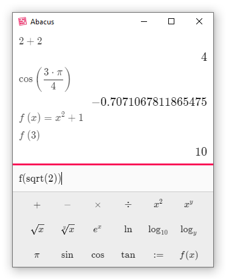

# Abacus

Abacus is a calculator with a small math language that supports user-defined
variables and functions.

Building Abacus is a little complicated.  You need
[GHC](https://www.haskell.org/ghc/), [Cabal](https://www.haskell.org/cabal/),
and [npm](https://www.npmjs.com/) installed.  Then run:

    cabal new-build
    npm install
    npm start        # to run directly from the repository
    npm run package  # to create an executable package

You can also run a command-line version of Abacus using `cabal new-run
abacus-console`.
