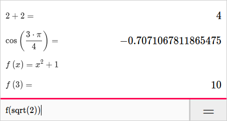

# Abacus



Abacus is a calculator with a small math language that supports user-defined
variables and functions.
[**Try it out!**](https://samarsha.github.io/abacus/)

## Building Abacus

Abacus uses Haskell with [Reflex](https://github.com/reflex-frp/reflex).
I recommend building Abacus with [GHCJS](https://github.com/ghcjs/ghcjs).
Here's how, assuming you have GHCJS installed:

```
npm install
cabal v2-build --ghcjs
```

This should create the folder `dist-newstyle/build/*/*/*/build/abacus/abacus.jsexe`, where the `*`'s depend on your system.
Open `index.html` in that folder in a web browser.

If you use Visual Studio Code, this repository uses a dev container that comes with GHCJS.
